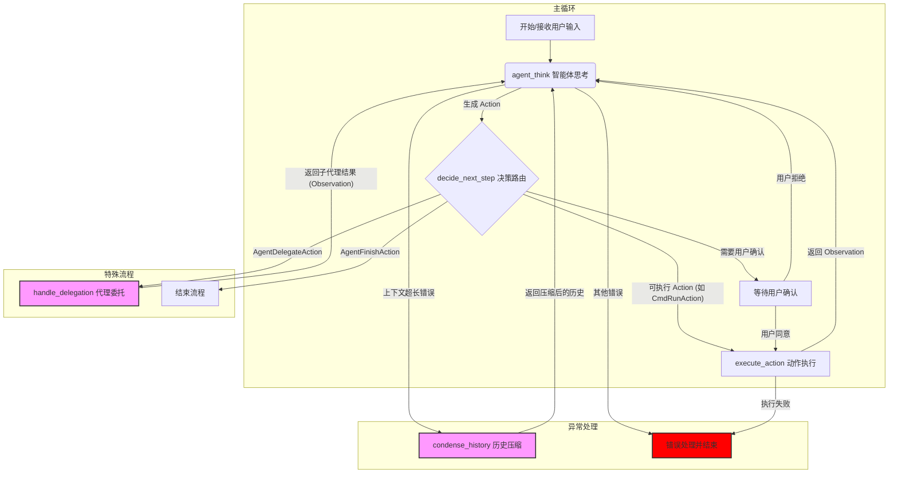

### **`openhands/` 核心代码库概览**

`openhands/` 目录是 OpenHands 项目的核心，包含了实现其智能代理功能的所有后端逻辑。其架构设计围绕着几个关键概念，通过事件驱动的方式进行通信和协作。

**核心控制流程**

代理（Agent）的运行遵循一个基本的循环：

1.  **生成提示 (Prompt)**：`Agent` 根据当前状态（`State`）生成一个发送给大语言模型（LLM）的提示。
2.  **调用 LLM**：`LLM` 组件接收提示并返回模型的响应。
3.  **解析动作 (Action)**：`Agent` 解析 LLM 的响应，将其转换成一个具体的操作指令（`Action`），例如“运行一个命令”或“修改一个文件”。
4.  **执行动作**：`Runtime`（运行时环境）负责执行这个 `Action`。
5.  **获取观察结果 (Observation)**：`Runtime` 将执行结果作为 `Observation` 返回。
6.  **更新状态**：`State` 根据执行的 `Action` 和返回的 `Observation` 进行更新，为下一步决策做准备。

所有这些组件之间的通信都通过一个中央事件中心 `EventStream` 来完成，实现了各部分的解耦。

---

### **各模块功能详解**

以下是 `openhands` 目录下每个子目录（模块）的功能说明：

*   **`agenthub/` (智能体中心)**
    *   存放了各种不同类型的预定义智能体（Agent）。每个智能体有不同的技能和行为模式，例如 `codeact_agent` (代码操作代理), `browsing_agent` (网页浏览代理) 等。你可以在这里添加或修改智能体。

*   **`cli/` (命令行界面)**
    *   包含了项目的命令行接口（Command-Line Interface）代码。当你从终端运行 `openhands` 命令时，就是这部分代码在负责解析参数、启动程序。

*   **`controller/` (控制器)**
    *   这是智能体的“大脑”或“指挥中心”。`AgentController` 在这里定义，它负责初始化智能体、管理其生命周期和状态（`State`），并驱动整个核心控制流程的循环。

*   **`core/` (核心)**
    *   定义了整个项目中最基础、最核心的数据结构、常量和枚举。例如，这里可能定义了 `Action` 和 `Observation` 的基础类别，以及整个系统共享的配置。

*   **`critic/` (评估器)**
    *   一个用于评估智能体产生的动作或计划质量的模块。它像一个“批评家”，可以对 LLM 生成的结果进行打分或提出修正意见，以提高最终输出的质量。

*   **`events/` (事件系统)**
    *   定义了系统内所有的事件类型，并管理事件的发布和订阅。这是实现 `EventStream` 事件流通信的核心，让不同模块可以独立地对特定事件做出反应。

*   **`experiments/` (实验)**
    *   用于运行和管理各类评估实验的代码。如果你想测试不同模型或不同智能体在特定任务上的表现，相关的脚本和工具会放在这里。

*   **`integrations/` (集成)**
    *   用于与第三方服务进行集成的代码。例如，��� GitHub, GitLab, Jira 等外部系统进行交互的逻辑就存放在这里。

*   **`io/` (输入/输出)**
    *   处理与用户的输入和输出交互。它管理着如何在终端显示信息、接收用户输入等。

*   **`linter/` (代码规范检查器)**
    *   包含了用于检查代码规范的工具。当智能��生成或修改代码时，这个模块可以用来确保代码风格统一，并发现潜在的错误。

*   **`llm/` (大语言模型)**
    *   封装了与大语言模型（LLMs）交互的所有逻辑。它负责处理 API 请求、管理不同的模型提供商（如 OpenAI, Anthropic 等），并向上层提供统一的调用接口。

*   **`mcp/` (主控制程序)**
    *   从代码结构上看，这部分可能是 "Main Control Program" 的缩写，负责协调更上层的任务规划和分解。

*   **`memory/` (记忆)**
    *   为智能体提供记忆功能。这可能包括短期记忆（如最近的几次对话历史）和长期记忆（需要持久化存储的知识或经验）。

*   **`microagent/` (微代理)**
    *   定义了“微代理”的结构或基类。这是一种更小、更专注的代理，可能用于执行复杂任务中的某一个具体子任务。

*   **`resolver/` (解析器)**
    *   负责处理和解析特定任务或目标的模块。例如，当一个任务目标是“修复一个 bug”时，解析器可能会将其分解为“读文件”、“分析代码”、“写补丁”等一系列子任务。

*   **`runtime/` (运行时)**
    *   这是 `Action` 的执行环境。它提供了一个安全的沙箱（Sandbox），用于执行代码、运行 shell 命令、读写文件等操作，并将执行结果作为 `Observation` 返回。它支持多种后端，如 Docker、Kubernetes 或本地直接执行。

*   **`security/` (安全)**
    *   包含与安全相关的功能，例如扫描代码中的漏洞、管理敏感信息、以及确保沙箱环境的隔离性。

*   **`server/` (服务器)**
    *   提供一个 HTTP 服务器，用于通过 API 的方式暴露 OpenHands 的功能。这是驱动 Web 前端（UI）或允许外部程序与智能体交互的关键。

*   **`storage/` (存储)**
    *   负责数据的持久化存储。例如，将智能体的记忆、会话历史或任务状态保存到数��库或文件中。

*   **`utils/` (工具)**
    *   包含项目中各处都会用到的通用工具函数或辅助类。

---
### **`openhands/controller/` 目录文件详解**

这个目录是 OpenHands 系统的“中枢神经”，负责定义智能体（Agent）的行为、驱动其执行任务、管理其状态，并处��各种复杂情况，如任务重放、错误检测和状态管理。

---

#### **`agent.py` - 智能体的“蓝图”**

*   **核心作用**: 定义了所有智能体的抽象基类 `Agent`。它像一个接口或模板，规定了任何一个具体的智能体（例如 `CodeActAgent`）都必须具备哪些基本能力。
*   **主要内容**:
    *   **`Agent` (抽象类)**:
        *   `step(self, state: State) -> Action`: 这是最重要的抽象方法。每个智能体都必须实现它，定义了在给定当前状态（`State`）的情况下，下一步应该执行什么动作（`Action`）。
        *   `reset(self)`: 重置智能体的内部状态，为下一个任务做准备。
        *   `_registry`: 一个类级别的注册表，用于存储所有已定义的智能体类，使得可以通过名字��字符串）来获取和使用它们。
        *   `get_system_message(self)`: 生成并返回一个包含系统指令（System Prompt）的 `SystemMessageAction`，这个消息会作为对话的第一个事件，为 LLM 设定角色和目标。

---

#### **`agent_controller.py` - 智能体的“驾驶员”**

*   **核心��用**: 这是整个项目的核心控制器，是驱动智能体一步步完成��务的引擎。它管理着主事件循环，并协调智能体、事件流和运行时环境之间的所有交互。
*   **主要内容**:
    *   **`AgentController` (类)**:
        *   **主循环 (`_step`)**: 这是最核心的逻辑。它调用 `agent.step()` 来获取下一个 `Action`，然后将这个 `Action` 发送到事件流（`EventStream`）。
        *   **事件处理 (`on_event`)**: 监听来自 `EventStream` 的所有事件。当收到用户的消息或环境的观察结果（`Observation`）时，它会决定是否触发 `_step` 让智能体继续工作。
        *   **状态管理**: 维护一个 `State` 对象，记录了任务的所有历史、当前状态（如 `RUNNING`, `PAUSED`, `ERROR` 等）。它通过 `set_agent_state_to` 方法来改变智能体的状态。
        *   **错误和异常处理**: 包含大量的 `try...except` 块，用于捕获在与 LLM 交互或执行动作时可能发生的各种错误（如 API 超时、内容限制、代码执行失败等），并做出相应的处理。
        *   **代理委托 (`start_delegate`, `end_delegate`)**: 实现多智能体协作的关键。一个 `AgentController` 可以将���个子任务委托给另一个新的 `AgentController` 来处理，从而实现复杂的任务分解。
        *   **预算和迭代限制**: 监控任务的开销和执行步数，确保不会超出预设的限制。

---

#### **`state.py` - 任务的“记忆体”**

*   **核心作用**: 定义了 `State` 数据类，它像一个快照，封装了智能体在任何特定时间点执行任务所需的所有上下文信息。
*   **主要内容**:
    *   **`State` (数据类)**:
        *   `history`: 一个列表，包含了从任务开始到现在的所有 `Action` 和 `Observation` 事件，是智能体最重要的“记忆”。
        *   `agent_state`: 智能体当前的状态，例如 `RUNNING`, `FINISHED`, `AWAITING_USER_INPUT`。
        *   `iteration` & `max_iterations`: 当前迭代次数和最大迭代限制。
        *   `last_error`: 如果发生错误，这里会记录最后一条错误信息。
        *   `inputs` & `outputs`: 任务的输入参数和最终的输出结果。
        *   `metrics`: 记录与 LLM 交互的成本、token 数量等指标。

---

#### **`action_parser.py` - LLM 响应的“翻译官”**

*   **核心作用**: 定义了如何解析大语言模型（LLM）返回的响应（通常是文本或 JSON），并将其转换成系统可以理解和执行的 `Action` 对象。
*   **主要内容**:
    *   **`ResponseParser` (抽象类)**: 定义了解析器的通用接口，规定了解析器必须有一个 `parse` 方法。
    *   **`ActionParser` (抽象类)**: 针对不同类型的 `Action`，定义了更具体的解析逻辑。例如，一个解析器可能专门负责从文本中识别 `CmdRunAction`（执行命令），另一个则负责识别 `FileWriteAction`（写文件）。
    *   **`ActionParseError` (异常)**: 当无法成功解析 LLM 的响应时，会抛出此异常。

---

#### **`stuck.py` - “防卡死”检测器**

*   **核心作用**: 这是一个非常重要的保护机制，用于检测智能体是否陷入了无限循环或“卡死”状态。
*   **主要内容**:
    *   **`StuckDetector` (类)**:
        *   `is_stuck(self)`: 核心检测方法。它会分析 `state.history` 中的事件序列，通过多种模式匹配来判断智能体是否在重复同样的行为而没有任何进展。
        *   **检测模���包括**:
            1.  **重复的动作和观察**: 连续多次执行完全相同的 `Action` 并得到完全相同的 `Observation`。
            2.  **重复的动作和错误**: 连续多次执行相同的 `Action` 并总是得到错误。
            3.  **独白 (Monologue)**: 智能体连续多次给自己发送相同的消息，而没有与环境进行有效交互。
            4.  **重复的模式**: 检测到 (动作A, 观察A), (动作B, 观察B), (动作A, 观察A), ... 这样的交替重复模式。

---

#### **`replay.py` - 任务的“录像机”**

*   **核心作用**: 提供了任务回放（Replay）的功能。它可以加载一个之前保存的任务历史（称为 "trajectory"），并精确地重现当时智能体的每一步操作。
*   **主要内容**:
    *   **`ReplayManager` (类)**:
        *   `should_replay(self)`: 判断当前是否处于回放模式，以及是否还有未回放的步骤。
        *   `step(self)`: 在回放模式下，它会取代 `agent.step()`，从历史记录中取出下一个 `Action` 并返回，而不是让 LLM 重新决策。
        *   这对于调试、复现问题和评估��能体的稳定性至关重要。

---
### **核心工作流分析 (节点化视角)**

为了更好地理解和未来可能的技术演进（如使用 LangGraph），我们可以将 `AgentController` 的复杂流程分解为一系列逻辑“节点”。

#### **1. OpenHands 核心流程的“节点化”分析**

整个流程可以看作是一个循环图，其核心目标是根据状态（State）生成一个动作（Action），执行它，然后根据观察结果（Observation）更新状态，如此往复，直到任务完成。

*   **`agent_think` (智能体思考节点)**: 整个流程的“大脑”，负责决策下一步该做什么。
    *   **输入**: `State` 对象（包含历史记录）。
    *   **核心处理**: 调用 `Agent.step()`，内部完成提示构建、与 LLM 交互、解析响应。
    *   **输出**: 一个结构化的 `Action` 对象。

*   **`decide_next_step` (决策路由节点/条件边)**: 根据 `agent_think` 的输出，决定流程的走向。
    *   **输入**: `Action` 对象。
    *   **核心处理**: 检查 `Action` 的类型（是执行、是结束、还是委托？）。
    *   **输出**: 一个路由指令，决定下一个被激活的节点。

*   **`execute_action` (动作执行节点)**: 代表智能体与“世界”的交互。
    *   **输入**: 一个可执行的 `Action` 对象（如 `CmdRunAction`）。
    *   **核心处理**: 调用 `Runtime` 模块在安全环境中执行动作。
    *   **输出**: 一个 `Observation` 对象，封装了动作执行的结果。

*   **`handle_delegation` (代理委托节点)**: 处理多智能体协作的特殊复合节点。
    *   **输入**: `AgentDelegateAction`。
    *   **核心处理**: 创建一个新的子 `AgentController` 来处理子任务，并等待其完成。
    *   **输出**: `AgentDelegateObservation`，包含了子代理的执行结果。

*   **`condense_history` (历史压缩节点)**: 处理“上下文窗口超长”问题的异常流程节点。
    *   **输入**: 完整的 `State.history`。
    *   **核心处理**: 调用 LLM 总结和压缩历史记录。
    *   **输出**: `AgentCondensationObservation`，包含了压缩后的历史摘要。

#### **2. 可视化工作流程**

下面这张图清晰地展示了这些节点如何连接成一个完整的工作流。

#### **3. 深入核心节点：`agent_think` 的内部实现**

这个节点是整个系统的智能核心，其代码层面的执行路径如下：

1.  **起点 (`agent_controller.py`)**: `AgentController._step()` 调用 `self.agent.step(self.state)`。
2.  **提示构建 (e.g., `agenthub/codeact_agent.py`)**: `agent.step()` 使用 `PromptManager` 将 `State.history` 格式化成一个完整的提示。
3.  **LLM 交互 (`llm/llm.py`)**: `agent.step()` 调用 `self.llm.completion()`，由 `LLM` 类处理所有与大语言模型 API 的底层交互。
4.  **响应解析 (`controller/action_parser.py`)**: `agent.step()` 拿到 LLM 的响应，并使用 `ResponseParser` 将其从非结构化文本转换成一个结构化的 `Action` 对象。

这个流程清晰地展示了从高级状态到具体行动意图的转换过程，是整个智能体决策能力的核心体现。

---
### **附录A: 架构演进 - 引入 LangGraph**

为了提升系统的模块化、可观测性和可维护性，我们进行了一项重大的架构升级，引入了`LangGraph`来替代原有的`AgentController`和`EventStream`机制。但为了保证系统的稳定性，我们采取了**双引擎并存、可配置切换**的策略。

#### **双引擎架构**

现在，OpenHands拥有两套核心执行引擎：
1.  **`controller` (默认引擎)**: 稳定、经过长期验证的旧引擎。
2.  **`langgraph` (实验性引擎)**: 基于图和状态传递的新引擎，提供了更清晰的控制流。

通过在核心配置文件中设置`engine`字段，用户可以选择启动时使用哪个引擎。

#### **`openhands/graphs/` - 新引擎核心**
我们创建了一个全新的目录`openhands/graphs/`，用于存放新引擎的所有代码，它与旧的`controller`和`events`目录完全隔离。其主要组件包括：
- **`schemas.py`**: 使用Pydantic定义了所有新的、可序列化的`Action`和`Observation`数据结构。
- **`nodes.py`**: 定义了图的各个功能节点，如`agent_think`（思考）、`execute_action`（执行）等。
- **`edges.py`**: 定义了图的条件边，负责根据当前状态决定流程的走向。
- **`builder.py`**: 将所有节点和边组装成一个可执行的`StatefulGraph`对象。
- **`stuck_detector_logic.py`**: 移植并封装了旧引擎中宝贵的“防卡死”逻辑。
- **`synchronous_runtime.py`**: 一个适配器，让新的图引擎能够调用旧的`LocalRuntime`。

#### **服务器适配**
为了支持新引擎，我们创建了一个新的API入口：
- **`POST /v2/conversations`**: 这个端点专门用于创建和运行基于`LangGraph`的会话，它通过SSE（Server-Sent Events）将每一步的状态变化流式传输回客户端。
- 旧的`POST /conversations`端点保持不变，继续使用`controller`引擎。

#### **兼容性修改**
我们对旧代码的唯一修改是在`openhands/events/serialization/event.py`中，我们增强了`event_to_dict`函数，使其能够同时处理旧的`dataclasses`和新的`Pydantic`模型。这是一个向后兼容的增强，是实现双引擎共存的关键。

---
### **附录B: 独立逻辑基准 - `StuckDetector`**

在进行重构前，我们首先将`StuckDetector`的核心逻辑提取到了一个独立可验证的脚本中，以确保其宝贵的、经过实战检验的功能不会在迁移过程中丢失。

- **`standalone_stuck_detector.py`**: 包含了`StuckDetector`的纯净逻辑实现和模拟的数据类。
- **`test_standalone_stuck_detector.py`**: 使用`unittest`为`StuckDetector`的每一种循环检测模式编写了专门的测试用例。

这个逻辑基准可以通过运行`python -m unittest test_standalone_stuck_detector.py`来随时验证，为我们的重构工作提供了坚实的安全保障。